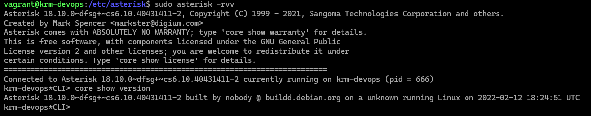
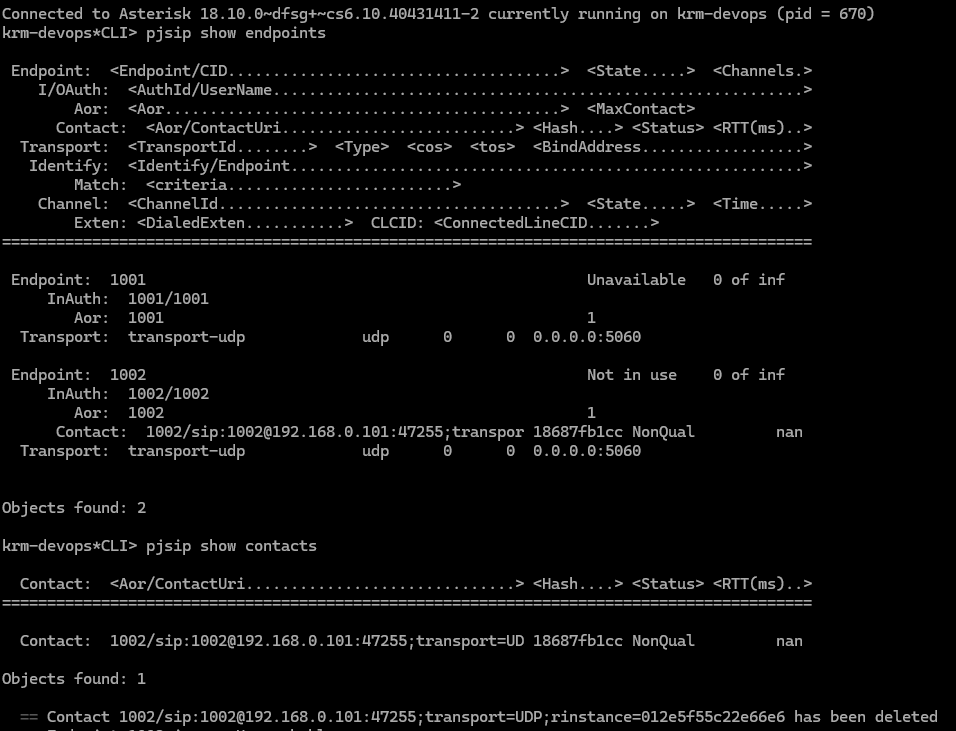
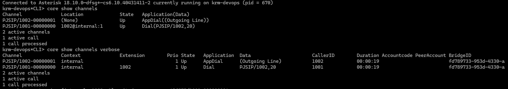

# ☎️ Asterisk VoIP PBX

A hands-on VoIP project demonstrating the setup and configuration of an
**Asterisk Private Branch Exchange (PBX)** using **PJSIP**.

The project includes Asterisk installation, SIP endpoint configuration,
dialplan configuration, and successful extension-to-extension calling.

---

## 🚀 Project Overview

In this project, I configured an Asterisk-based VoIP PBX environment and
successfully established calls between SIP extensions.

### What I implemented

- Installed Asterisk on Linux
- Configured PJSIP
- Created SIP extensions
- Configured Asterisk dialplan
- Configured RTP
- Connected SIP clients
- Successfully tested extension-to-extension calls

---

## 🏗️ Architecture

```text
              ┌─────────────────────┐
              │     SIP Client 1    │
              │     Extension 1001  │
              └──────────┬──────────┘
                         │
                         │ SIP
                         ▼
              ┌─────────────────────┐
              │      Asterisk       │
              │      VoIP PBX       │
              │                     │
              │ ┌─────────────────┐ │
              │ │     PJSIP       │ │
              │ │ Configuration   │ │
              │ └─────────────────┘ │
              │                     │
              │ ┌─────────────────┐ │
              │ │    Dialplan     │ │
              │ │ extensions.conf │ │
              │ └─────────────────┘ │
              │                     │
              │ ┌─────────────────┐ │
              │ │      RTP        │ │
              │ │     Media       │ │
              │ └─────────────────┘ │
              └──────────┬──────────┘
                         │
                         │ SIP
                         ▼
              ┌─────────────────────┐
              │     SIP Client 2    │
              │     Extension 1002  │
              └─────────────────────┘
```

### Call Flow

```text
SIP Client
    │
    │ SIP REGISTER
    ▼
Asterisk / PJSIP
    │
    │ Extension Dial
    ▼
Dialplan
    │
    │ Call Routing
    ▼
Destination Extension
    │
    │ RTP
    ▼
Voice Communication
```

---

## 🧩 Technologies Used

| Technology | Purpose |
|------------|---------|
| Asterisk | VoIP PBX |
| PJSIP | SIP endpoint configuration |
| SIP | Call signaling |
| RTP | Voice media |
| Linux | Server operating system |
| Bash | Command-line administration |

---

## ⚙️ Asterisk Configuration

### PJSIP

PJSIP is used to configure SIP endpoints and authentication.

Example:

```ini
[1001]
type=endpoint
context=internal
disallow=all
allow=ulaw
auth=1001
aors=1001

[1001]
type=auth
auth_type=userpass
username=1001
password=CHANGE_ME

[1001]
type=aor
max_contacts=1
```

> **Note:** Never commit real SIP passwords or secrets to GitHub.

---

## ☎️ Extension Configuration

The dialplan is configured in:

```text
/etc/asterisk/extensions.conf
```

Example:

```ini
[internal]

exten => 1001,1,Dial(PJSIP/1001,20)
exten => 1002,1,Dial(PJSIP/1002,20)
```

This allows the configured SIP extensions to call each other.

---

## 🔧 Useful Asterisk CLI Commands

Enter the Asterisk CLI:

```bash
sudo asterisk -rvvv
```

Check PJSIP endpoints:

```bash
pjsip show endpoints
```

Check a specific endpoint:

```bash
pjsip show endpoint 1001
```

Show registered contacts:

```bash
pjsip show contacts
```

Show active channels:

```bash
core show channels
```

Reload PJSIP configuration:

```bash
pjsip reload
```

Reload the dialplan:

```bash
dialplan reload
```

---

## 🧪 Testing

The configuration was tested using SIP clients connected to the Asterisk server.

### Test Result

- ✅ Asterisk server running
- ✅ PJSIP configured
- ✅ SIP extensions registered
- ✅ Dialplan configured
- ✅ Extension-to-extension call successful
- ✅ Voice communication successfully established

---

## 📸 Screenshots

### Asterisk CLI



### PJSIP Extensions



### Successful Call



---

## 📁 Project Structure

```text
asterisk-voip-pbx/
│
├── README.md
├── asterisk/
│   ├── pjsip.conf
│   ├── extensions.conf
│   └── rtp.conf
│
├── docs/
│   ├── architecture.md
│   ├── setup.md
│   └── troubleshooting.md
│
├── screenshots/
│   ├── asterisk-running.png
│   ├── pjsip-extensions.png
│   └── successful-call.png
│
└── .gitignore
```

---

## 🎯 Learning Outcomes

Through this project, I gained hands-on experience with:

- Linux server administration
- Asterisk PBX
- SIP and VoIP fundamentals
- PJSIP configuration
- SIP endpoint management
- Dialplan configuration
- RTP and voice communication
- Troubleshooting VoIP connectivity

---

## 🚧 Future Improvements

- Interactive Voice Response (IVR)
- Voicemail
- Call recording
- Conference calling
- Call queues
- Automated Asterisk deployment
- Monitoring and logging

---

## 👨‍💻 Author

**Koushik**

This project is part of my hands-on DevOps and Linux learning journey.